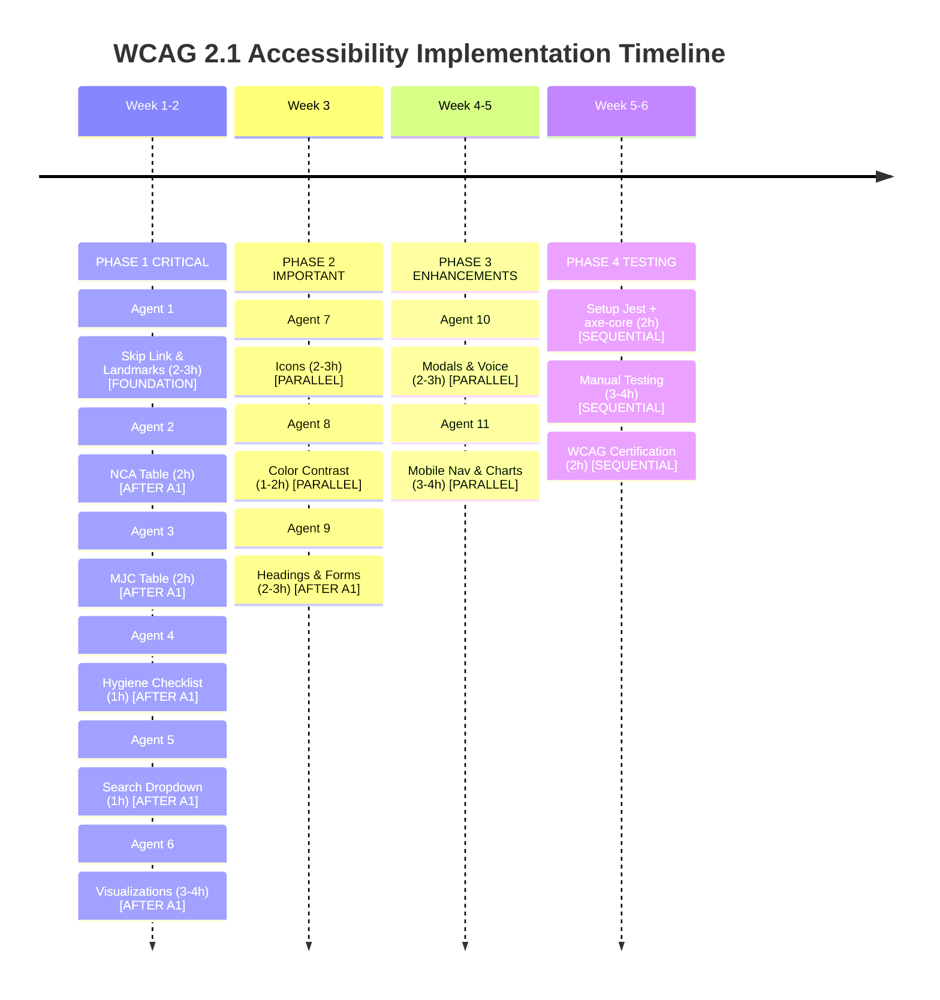

# WCAG 2.1 Accessibility Implementation Plan
## Multi-Agent Orchestration & TDD-First Delivery

**Document Version:** 1.0
**Date Created:** November 2024
**Target Compliance:** WCAG 2.1 Level AA
**Current Compliance:** Level A (~65/100)
**Total Estimated Effort:** 25-30 hours
**Timeline:** 4-6 weeks
**Execution Model:** 11 Parallel Agents (Phases 1-4)

---

## Table of Contents

1. [Executive Summary](#executive-summary)
2. [Autonomous Agent System Overview](#autonomous-agent-system-overview)
3. [Phase 1: Critical Fixes (Parallel Agents 1-6)](#phase-1-critical-fixes)
4. [Phase 2: Important Fixes (Parallel Agents 7-9)](#phase-2-important-fixes)
5. [Phase 3: Enhancement Fixes (Parallel Agents 10-11)](#phase-3-enhancement-fixes)
6. [Phase 4: Testing & Validation (Sequential)](#phase-4-testing--validation)
7. [Test-Driven Development Framework](#test-driven-development-framework)
8. [Parallel Execution Graph](#parallel-execution-graph)
9. [Success Criteria & Quality Gates](#success-criteria--quality-gates)
10. [PR Templates & Review Checklists](#pr-templates--review-checklists)
11. [Agent Skill Templates](#agent-skill-templates)

---

## Executive Summary

### Current State
- **Audit Completed:** ACCESSIBILITY_AUDIT.md identifies 18 violations
- **Test Infrastructure:** Removed in recent cleanup, requires rebuild
- **Git State:** Linear history on `claude/accessibility-wcag-review-*` branch
- **Team Capacity:** 1-2 developers, parallel agent execution recommended

### Delivery Model
This plan deploys **11 specialized autonomous agents** across 4 phases:

- **Phase 1 (Week 1-2):** 6 agents fix critical issues in parallel
- **Phase 2 (Week 3):** 3 agents fix important issues in parallel
- **Phase 3 (Week 4-5):** 2 agents implement enhancements in parallel
- **Phase 4 (Week 5-6):** Sequential testing & validation

### Key Innovation: TDD-First Parallelization
Each agent operates independently with:
- **Pre-written test file** (red → green)
- **Implementation code** (makes tests pass)
- **Non-overlapping components** (no merge conflicts)
- **PR-ready deliverables** (immediately mergeable)

---

## Autonomous Agent System Overview

### Agent Roles & Non-Overlapping Domains

| Agent | Domain | Dependencies | Status |
|-------|--------|--------------|--------|
| **Agent 1** | Skip Link & Landmarks | None | Phase 1 |
| **Agent 2** | Table Accessibility (NCA) | Agent 1 | Phase 1 |
| **Agent 3** | Table Accessibility (MJC) | Agent 1 | Phase 1 |
| **Agent 4** | Form Grouping (Hygiene Checklist) | Agent 1 | Phase 1 |
| **Agent 5** | Search Dropdown Accessibility | Agent 1 | Phase 1 |
| **Agent 6** | Visualization Accessibility | Agent 1 | Phase 1 |
| **Agent 7** | Icon Accessibility | None | Phase 2 |
| **Agent 8** | Color Contrast & Verification | None | Phase 2 |
| **Agent 9** | Heading Hierarchy & Form Fields | Agent 1 | Phase 2 |
| **Agent 10** | Modal Focus Traps & Voice Input | None | Phase 3 |
| **Agent 11** | Mobile Navigation & Charts | None | Phase 3 |

### Parallelization Strategy

```
PHASE 1 (Week 1-2): Critical Fixes
├─ Agent 1 [FOUNDATION] → Skip Link & Landmarks (2-3 hours)
│  └─ Unblocks: Agents 2, 3, 4, 5, 6, 9
├─ Agent 2 [PARALLEL] → NCA Table (2 hours) [After Agent 1]
├─ Agent 3 [PARALLEL] → MJC Table (2 hours) [After Agent 1]
├─ Agent 4 [PARALLEL] → Form Grouping (1 hour) [After Agent 1]
├─ Agent 5 [PARALLEL] → Search Dropdown (1 hour) [After Agent 1]
└─ Agent 6 [PARALLEL] → Visualizations (3-4 hours) [After Agent 1]

PHASE 2 (Week 3): Important Fixes
├─ Agent 7 [PARALLEL] → Icons (2-3 hours)
├─ Agent 8 [PARALLEL] → Contrast Verification (1-2 hours)
└─ Agent 9 [PARALLEL] → Headings & Forms (2-3 hours) [After Agent 1]

PHASE 3 (Week 4-5): Enhancements
├─ Agent 10 [PARALLEL] → Modals & Voice (2-3 hours)
└─ Agent 11 [PARALLEL] → Mobile Nav & Charts (3-4 hours)

PHASE 4 (Week 5-6): Testing [SEQUENTIAL]
├─ Setup Jest + axe-core
├─ Manual Screen Reader Testing
├─ Keyboard Navigation Testing
└─ WCAG Compliance Certification
```

---

# PHASE 1: CRITICAL FIXES

## Agent 1: Skip Link & Landmarks Foundation Agent

### Context
The application lacks proper skip link navigation and ARIA landmarks. Keyboard users must tab through 15+ elements before reaching main content. Screen readers cannot identify navigation, main, and footer regions.

**Impact:** Blocks WCAG 2.1 Level A compliance (2.4.1 Bypass Blocks)
**Priority:** CRITICAL
**Effort:** 2-3 hours
**Files Affected:** 1 (app/layout.tsx)

### Model Role
**Agent 1: Landmark Infrastructure Specialist**

This agent establishes the accessibility foundation for all other agents. It must:
1. Add skip-to-main link with proper focus management
2. Mark all landmark regions (<header>, <nav>, <main>, <aside>, <footer>)
3. Add aria-labels to navigation regions
4. Create sr-only utility class for screen reader content
5. Test skip link keyboard navigation

**Assumptions:**
- Radix UI Dialog handles focus properly
- Tailwind CSS available for styling
- No existing sr-only utilities in codebase

### Prompts

**Prompt 1: Test-First Implementation**
```
Context: App/layout.tsx currently has no skip link or landmark ARIA
Task: Write FAILING tests first (red phase)
File: app/__tests__/layout.accessibility.test.tsx

Requirements:
1. Test skip link exists in DOM
2. Test skip link has href="#main-content"
3. Test skip link is screen-reader only (sr-only class)
4. Test skip link visible on focus
5. Test main element has id="main-content"
6. Test header has role="banner" or <header> tag
7. Test navigation has aria-label attribute
8. Test footer has role="contentinfo" or <footer> tag
9. Test pressing Tab once → skip link is focusable
10. Test pressing Enter on skip link → focus jumps to main

Template structure:
- Import render, screen, userEvent from testing library
- Use axe-core for ARIA validation
- Each test should fail initially (assert for missing elements)

Do NOT implement fixes yet - just write the failing tests.
```

**Prompt 2: Implementation (Green Phase)**
```
Context: Tests written in layout.accessibility.test.tsx are failing
Task: Implement changes to make ALL tests pass
Files to modify:
- app/layout.tsx (structure + elements)
- app/globals.css (sr-only utility class)

Implementation Steps:
1. Add skip link before NavigationProvider:
   <a href="#main-content" className="sr-only focus:not-sr-only">
     Skip to main content
   </a>

2. Add id="main-content" to main element:
   <main id="main-content" className="focus:outline-none">

3. Ensure semantic landmarks:
   <header role="banner"> or <header> (implicit role)
   <nav aria-label="Primary navigation">
   <aside aria-label="Secondary navigation">
   <footer role="contentinfo"> or <footer> (implicit role)

4. Add sr-only utility to globals.css (see Appendix A)

5. Test: npm run test:a11y -- layout.accessibility.test.tsx

Acceptance Criteria:
- All 10 tests passing
- No axe violations related to landmarks
- Skip link tested manually with keyboard
```

**Prompt 3: Refactoring (Green→Refactor Phase)**
```
Context: All skip link tests passing
Task: Ensure code quality and consistency
Review:
1. CSS sr-only class matches best practices (see Appendix A)
2. Skip link styling is accessible (3px ring on focus)
3. No hardcoded styles duplicated elsewhere
4. Comments explain why sr-only pattern is used
5. Tailwind configuration includes utility if needed

Refactoring checklist:
- [ ] Extract skip link to separate component if needed
- [ ] Verify skip link works with all browsers
- [ ] Add aria-label="Skip to main content" if needed
- [ ] Document skip link pattern in DESIGN_SYSTEM.md
```

### Tools

**Testing Framework Setup**
```typescript
// Install if not present
npm install --save-dev @testing-library/react @testing-library/jest-dom jest axe-core jest-axe @axe-core/react

// Create jest.config.js if missing
module.exports = {
  preset: 'ts-jest',
  testEnvironment: 'jsdom',
  moduleNameMapper: {
    '^@/(.*)$': '<rootDir>/$1',
  },
  setupFilesAfterEnv: ['<rootDir>/jest.setup.js'],
};

// Create jest.setup.js
import '@testing-library/jest-dom';
import { expect } from '@jest/globals';
import { toHaveNoViolations } from 'jest-axe';
expect.extend(toHaveNoViolations);
```

**Test Utilities**
```typescript
// lib/test-utils.tsx
import { ReactElement } from 'react';
import { render, RenderOptions } from '@testing-library/react';
import { axe, toHaveNoViolations } from 'jest-axe';

export function renderWithA11y(ui: ReactElement, options?: RenderOptions) {
  const rendered = render(ui, options);
  return {
    ...rendered,
    checkAccessibility: async () => {
      const results = await axe(rendered.container);
      expect(results).toHaveNoViolations();
    },
  };
}
```

### Skills Template

**Do's**
- ✅ Write tests FIRST (red), then implement (green)
- ✅ Use semantic HTML (<header>, <nav>, <main>, <footer>)
- ✅ Test with actual keyboard (Tab key)
- ✅ Verify skip link with screen reader
- ✅ Document why sr-only pattern is needed
- ✅ Run axe-core on every commit

**Don'ts**
- ❌ Use role="banner" if using <header> tag (redundant)
- ❌ Hide skip link with display:none (will be inaccessible)
- ❌ Create skip link without href="#main-content"
- ❌ Forget to add id="main-content" to target element
- ❌ Skip manual keyboard testing
- ❌ Use JavaScript to manage focus (let native HTML handle it)

**Examples & Analogies**
```typescript
// ❌ WRONG: Skip link hidden permanently
<a href="#main" style={{ display: 'none' }}>Skip to main</a>

// ✅ CORRECT: Skip link hidden visually but available to keyboard/screen reader
<a href="#main-content" className="sr-only focus:not-sr-only">
  Skip to main content
</a>

// Analogy: Like an invisible door in a maze that becomes visible when you approach it
```

**Copy-Paste Ready Commands**
```bash
# Create test file
cat > app/__tests__/layout.accessibility.test.tsx << 'EOF'
// See Appendix B for full test template
EOF

# Run tests
npm run test:a11y -- layout.accessibility.test.tsx

# Run with watch mode
npm run test:a11y:watch -- layout.accessibility.test.tsx

# Verify no axe violations
npx axe-core http://localhost:3008
```

---

## Agent 2: NCA Table Accessibility Agent

### Context
The NCA Register table lacks proper semantic structure for accessibility. Missing:
- `<thead>`, `<tbody>` organization
- Column header `scope` attributes
- Sort state announcements (aria-sort)
- Table `aria-label` and `aria-describedby`

**Impact:** Screen reader users cannot understand table structure
**Priority:** CRITICAL
**Effort:** 2 hours
**Files Affected:** 2 (components/dashboard/nca-register.tsx, test file)
**Dependency:** Agent 1 must complete first (needs sr-only utility)

### Model Role
**Agent 2: Table Semantics Specialist**

This agent transforms the NCA register into an accessible HTML table:
1. Restructure table with proper `<thead>`, `<tbody>`
2. Add `scope="col"` and `scope="row"` attributes
3. Implement aria-sort for sortable columns
4. Add keyboard navigation for sort buttons
5. Create live region for sort announcements

**Assumptions:**
- Existing table uses div-based layout (non-semantic)
- Sorting logic already implemented
- No complex colspan/rowspan scenarios

### Prompts

**Prompt 1: Test-First (Red Phase)**
```
Context: NCA Register uses non-semantic table markup
Task: Write FAILING tests for table accessibility
File: components/__tests__/nca-register.accessibility.test.tsx

Requirements:
1. Test <table> element exists
2. Test <thead> contains all column headers
3. Test each <th> has scope="col"
4. Test <tbody> contains all data rows
5. Test <td> elements have proper cell structure
6. Test table has aria-label
7. Test sortable columns have aria-sort attribute
8. Test aria-sort is "ascending", "descending", or "none"
9. Test sort button is keyboard accessible (Enter key)
10. Test aria-live region announces sort changes
11. Test column headers read as headers by screen reader
12. Test table data cells associated with headers

Test Template:
```typescript
describe('NCA Register Table Accessibility', () => {
  it('should have proper table structure', () => {
    const { container } = render(<NCARegister />);
    expect(container.querySelector('table')).toBeInTheDocument();
    expect(container.querySelector('thead')).toBeInTheDocument();
    expect(container.querySelector('tbody')).toBeInTheDocument();
  });

  it('should have aria-label on table', () => {
    render(<NCARegister />);
    expect(screen.getByRole('table', { name: /non-conformance/ })).toBeInTheDocument();
  });

  it('should announce sort state', async () => {
    const { container } = render(<NCARegister />);
    const sortButton = screen.getByRole('button', { name: /NCA Number/ });

    await userEvent.click(sortButton);

    const liveRegion = container.querySelector('[aria-live="polite"]');
    expect(liveRegion).toHaveTextContent(/sorted|ascending/i);
  });
  // ... more tests
});
```

Do NOT implement yet - write all tests failing first.
```

**Prompt 2: Implementation (Green Phase)**
```
Context: All table accessibility tests are failing
Task: Implement semantic table structure
File: components/dashboard/nca-register.tsx (main component)

Implementation checklist:
1. Replace div-based layout with semantic <table>:
   ```typescript
   <table
     aria-label="Non-Conformance Advice Register"
     aria-describedby="nca-table-description"
   >
     <caption className="sr-only" id="nca-table-description">
       Table of non-conformance records. Click column headers to sort.
     </caption>
     <thead>
       <tr>
         {columns.map(col => (
           <th key={col.key} scope="col">
             {col.sortable ? (
               <button
                 onClick={() => handleSort(col.key)}
                 aria-label={`${col.label}, ${getSortStateLabel(col.key)}`}
                 aria-sort={getSortState(col.key)}
                 className="flex items-center gap-2"
               >
                 {col.label}
                 {sortField === col.key && (
                   <span aria-hidden="true">
                     {sortDirection === 'asc' ? '↑' : '↓'}
                   </span>
                 )}
               </button>
             ) : (
               col.label
             )}
           </th>
         ))}
       </tr>
     </thead>
     <tbody>
       {items.map(item => (
         <tr key={item.id}>
           <td>{item.nca_number}</td>
           {/* Additional cells */}
         </tr>
       ))}
     </tbody>
   </table>
   ```

2. Add aria-live region for sort announcements:
   ```typescript
   <div
     aria-live="polite"
     aria-atomic="true"
     className="sr-only"
     role="status"
   >
     Table sorted by {sortField} {sortDirection}
   </div>
   ```

3. Implement helper functions:
   ```typescript
   function getSortState(fieldKey: string): 'ascending' | 'descending' | 'none' {
     if (sortField !== fieldKey) return 'none';
     return sortDirection === 'asc' ? 'ascending' : 'descending';
   }

   function getSortStateLabel(fieldKey: string): string {
     if (sortField !== fieldKey) return 'unsorted';
     return sortDirection === 'asc' ? 'sorted ascending' : 'sorted descending';
   }
   ```

4. Test: npm run test:a11y -- nca-register.accessibility.test.tsx

Acceptance Criteria:
- All tests passing
- No axe violations
- Manual keyboard: Tab to header → Enter to sort
- Screen reader: Announces "NCA Number, sorted ascending"
```

**Prompt 3: Refactoring (Green→Refactor)**
```
Context: All NCA table tests passing
Task: Optimize and document
Checklist:
1. Extract sort announcement logic to util function
2. Add prop types for table structure
3. Create reusable AccessibleTable wrapper component
4. Document in DESIGN_SYSTEM.md
5. Performance: Check table rerender on sort
6. Accessibility: Verify with NVDA/VoiceOver
```

### Tools

**Helper Functions Library** (lib/a11y/table-utils.ts)
```typescript
export type SortState = 'ascending' | 'descending' | 'none';

export function getSortState(
  sortField: string,
  currentField: string,
  direction: 'asc' | 'desc'
): SortState {
  if (sortField !== currentField) return 'none';
  return direction === 'asc' ? 'ascending' : 'descending';
}

export function getSortStateLabel(
  sortField: string,
  currentField: string,
  direction: 'asc' | 'desc'
): string {
  if (sortField !== currentField) return 'unsorted';
  return direction === 'asc' ? 'sorted ascending' : 'sorted descending';
}
```

### Skills Template

**Do's**
- ✅ Use `<table>`, `<thead>`, `<tbody>`, `<th>`, `<td>` elements
- ✅ Add `scope="col"` to column headers
- ✅ Add `scope="row"` to row headers (if applicable)
- ✅ Use `aria-sort="ascending" | "descending" | "none"`
- ✅ Announce sort changes with aria-live region
- ✅ Make sort buttons keyboard accessible
- ✅ Test with actual screen reader

**Don'ts**
- ❌ Use divs instead of table elements
- ❌ Forget scope attributes on headers
- ❌ Use aria-sort without proper table structure
- ❌ Hide sort direction visually (use text + icon)
- ❌ Skip aria-live announcements
- ❌ Create unsortable columns that look sortable

**Examples**
```typescript
// ❌ WRONG: Div-based table
<div className="table">
  <div className="header">NCA Number</div>
  <div className="row">NCA-001</div>
</div>

// ✅ CORRECT: Semantic table
<table>
  <thead>
    <tr>
      <th scope="col" aria-sort="ascending">NCA Number</th>
    </tr>
  </thead>
  <tbody>
    <tr>
      <td>NCA-001</td>
    </tr>
  </tbody>
</table>
```

---

## Agent 3: MJC Table Accessibility Agent

### Context
The MJC Register table has identical accessibility issues as NCA table.

**Impact:** Screen reader users cannot navigate MJC table
**Priority:** CRITICAL
**Effort:** 2 hours
**Files Affected:** 2 (components/dashboard/mjc-register.tsx, test file)
**Dependency:** Agent 1 complete, Agent 2 patterns apply here

### Model Role
**Agent 3: MJC Table Semantics Specialist**

Mirror of Agent 2 but applied to MJC register:
1. Use Agent 2 pattern as reference
2. Adapt for MJC-specific columns
3. Ensure parity with NCA table accessibility

### Prompts

**Prompt 1-3:** [Same structure as Agent 2, substituting MJC components]

**Key Differences from Agent 2:**
- File: `components/dashboard/mjc-register.tsx`
- Test file: `components/__tests__/mjc-register.accessibility.test.tsx`
- Table label: "Maintenance Job Card Register"
- Columns: job_card_number, date, machine, priority, status

### Skills Template

[Same as Agent 2, MJC-specific terminology]

---

## Agent 4: Form Grouping - Hygiene Checklist Agent

### Context
The hygiene checklist (10 required items) lacks `<fieldset>` and `<legend>` grouping. Screen reader users don't know these checkboxes form a cohesive group.

**Impact:** Screen reader cannot indicate form group semantics
**Priority:** CRITICAL
**Effort:** 1 hour
**Files Affected:** 2 (app/mjc/new/page.tsx, test file)
**Dependency:** Agent 1 complete

### Model Role
**Agent 4: Form Structure Specialist**

This agent wraps the hygiene checklist with proper form semantics:
1. Wrap 10 checkboxes in `<fieldset>`
2. Add `<legend>` describing the group
3. Add `aria-describedby` linking help text
4. Add progress indicator with aria-live
5. Create tests for fieldset structure

### Prompts

**Prompt 1: Test-First (Red Phase)**
```
Context: Hygiene checklist currently not grouped in fieldset
Task: Write FAILING tests
File: app/__tests__/mjc-form.accessibility.test.tsx (or new file)

Requirements:
1. Test <fieldset> element exists for hygiene checklist
2. Test <legend> contains "Hygiene Clearance Verification"
3. Test all 10 checkboxes inside fieldset
4. Test each checkbox has aria-describedby
5. Test progress indicator (X/10 items verified)
6. Test aria-live="polite" on progress indicator
7. Test legend is first child of fieldset
8. Test fieldset has no duplicates
9. Test legend text clearly indicates 10 items required
10. Test all checkboxes are keyboard accessible inside fieldset

Test template structure provided - write first as failing.
```

**Prompt 2: Implementation (Green Phase)**
```
Context: All hygiene fieldset tests failing
Task: Implement fieldset grouping
File: app/mjc/new/page.tsx (locate hygiene checklist section)

Implementation:
```typescript
<fieldset className="border rounded-lg p-4 space-y-3">
  <legend className="text-sm font-semibold">
    Hygiene Clearance Verification
    <span className="text-destructive">*</span>
  </legend>

  <p className="text-xs text-muted-foreground" id="hygiene-help">
    All 10 items must be verified before clearance can be granted.
  </p>

  <div className="space-y-2">
    {hygieneItems.map((item, index) => (
      <label key={index} className="flex items-center gap-2 cursor-pointer">
        <Checkbox
          id={`hygiene-${index}`}
          checked={verified[index]}
          onChange={(checked) => handleVerify(index, checked)}
          aria-describedby={`hygiene-help hygiene-${index}-desc`}
        />
        <span id={`hygiene-${index}-desc`}>{item.label}</span>
      </label>
    ))}
  </div>

  <div
    className="text-sm font-medium"
    aria-live="polite"
    aria-atomic="true"
  >
    <span className="font-semibold">{verifiedCount}/10</span> items verified
    {verifiedCount === 10 && (
      <span className="text-green-600 ml-2">✓ Ready for clearance</span>
    )}
  </div>
</fieldset>
```

Acceptance Criteria:
- All tests passing
- Legend is first child of fieldset
- Progress updates announced by screen reader
- Tab key navigates through checkboxes properly
```

### Tools

**Form Grouping Utilities** (lib/a11y/form-utils.ts)
```typescript
export interface FormGroupProps {
  legend: string;
  required?: boolean;
  helpText?: string;
  ariaDescribedBy?: string;
  children: React.ReactNode;
}

export function FormGroup({
  legend,
  required = false,
  helpText,
  ariaDescribedBy,
  children,
}: FormGroupProps) {
  const helpId = helpText ? 'form-group-help' : undefined;

  return (
    <fieldset className="border rounded-lg p-4 space-y-3">
      <legend className="text-sm font-semibold">
        {legend}
        {required && <span className="text-destructive">*</span>}
      </legend>

      {helpText && (
        <p id={helpId} className="text-xs text-muted-foreground">
          {helpText}
        </p>
      )}

      {children}
    </fieldset>
  );
}
```

### Skills Template

**Do's**
- ✅ Wrap related form controls in `<fieldset>`
- ✅ Add `<legend>` as first child of fieldset
- ✅ Use `aria-describedby` to link help text
- ✅ Use `aria-live="polite"` for progress updates
- ✅ Test with Tab key navigation
- ✅ Verify legend is read first by screen reader

**Don'ts**
- ❌ Use div with role="group" instead of fieldset
- ❌ Put legend after form controls (must be first)
- ❌ Create nested fieldsets without clear purpose
- ❌ Forget aria-describedby on related controls
- ❌ Use generic "Form Group" legend (be specific)

---

## Agent 5: Global Search Dropdown Accessibility Agent

### Context
Global search dropdown lacks proper ARIA semantics. Missing:
- `role="listbox"` on results
- `role="option"` on individual results
- `aria-live` announcements
- Proper `aria-selected` states

**Impact:** Screen reader users cannot navigate search results
**Priority:** CRITICAL
**Effort:** 1 hour
**Files Affected:** 2 (components/navigation/global-search.tsx, test file)
**Dependency:** Agent 1 complete

### Model Role
**Agent 5: Search Interface Accessibility Specialist**

This agent transforms search results into accessible listbox pattern:
1. Add `role="listbox"` to results container
2. Add `role="option"` to result items
3. Add `aria-selected` tracking
4. Add `aria-live="polite"` for result count
5. Ensure arrow key navigation

### Prompts

**Prompt 1: Test-First (Red Phase)**
```
Context: Global search dropdown has no listbox semantics
Task: Write FAILING tests
File: components/__tests__/global-search.accessibility.test.tsx

Requirements:
1. Test search input exists and is accessible
2. Test search results container has role="listbox"
3. Test each result has role="option"
4. Test aria-selected updates on keyboard navigation
5. Test aria-live region announces result count
6. Test arrow keys navigate options
7. Test Enter selects current option
8. Test Escape closes dropdown
9. Test Tab moves focus out of listbox
10. Test screen reader announces "5 results found"
11. Test loading state announced with aria-live
12. Test "No results found" announced

Write all tests as FAILING first.
```

**Prompt 2: Implementation (Green Phase)**
```
Context: All search accessibility tests failing
Task: Implement listbox pattern
File: components/navigation/global-search.tsx

Key changes:
```typescript
{isOpen && (
  <>
    {/* Live region announcement */}
    <div
      className="sr-only"
      aria-live="polite"
      aria-atomic="true"
      role="status"
    >
      {isSearching
        ? 'Searching...'
        : `${results.length} results found`}
    </div>

    {/* Listbox container */}
    <div
      role="listbox"
      aria-label="Search results"
      className="absolute top-full mt-2 w-full bg-surface border rounded-md shadow-lg z-50"
    >
      {results.map((result, index) => (
        <button
          key={result.id}
          role="option"
          aria-selected={selectedIndex === index}
          onKeyDown={handleKeyDown}
          className="w-full px-4 py-3 text-left hover:bg-accent"
        >
          {/* Result content */}
        </button>
      ))}
    </div>
  </>
)}
```

Acceptance Criteria:
- All tests passing
- Arrow keys navigate results
- Enter/Space activates result
- Screen reader announces "Search results, listbox, 5 options"
```

### Tools

**Search Accessibility Hook** (hooks/useAccessibleSearch.ts)
```typescript
export function useAccessibleSearch() {
  const [selectedIndex, setSelectedIndex] = useState(-1);
  const [results, setResults] = useState<SearchResult[]>([]);

  const handleKeyDown = (e: React.KeyboardEvent) => {
    switch (e.key) {
      case 'ArrowDown':
        e.preventDefault();
        setSelectedIndex(prev =>
          prev < results.length - 1 ? prev + 1 : prev
        );
        break;
      case 'ArrowUp':
        e.preventDefault();
        setSelectedIndex(prev => prev > 0 ? prev - 1 : -1);
        break;
      case 'Enter':
        if (selectedIndex >= 0) {
          e.preventDefault();
          handleSelect(results[selectedIndex]);
        }
        break;
      case 'Escape':
        setSelectedIndex(-1);
        break;
    }
  };

  return { selectedIndex, handleKeyDown, setSelectedIndex };
}
```

### Skills Template

**Do's**
- ✅ Use `role="listbox"` for dropdown lists
- ✅ Use `role="option"` for list items
- ✅ Update `aria-selected` on navigation
- ✅ Announce result count with aria-live
- ✅ Support arrow key navigation
- ✅ Test keyboard without mouse

**Don'ts**
- ❌ Mix listbox pattern with menu pattern
- ❌ Forget aria-selected on options
- ❌ Skip aria-live announcements
- ❌ Allow focus escape from listbox
- ❌ Forget Escape key handling

---

## Agent 6: Visualization Accessibility Agent

### Context
Canvas/SVG-based visualizations (5-Why, Fishbone, Timeline) have no keyboard access or text alternatives. Users with assistive tech cannot access this content.

**Impact:** Cannot navigate complex visualizations
**Priority:** CRITICAL
**Effort:** 3-4 hours
**Files Affected:** 6 (3 visualization files + 3 test files)
**Dependency:** Agent 1 complete

### Model Role
**Agent 6: Interactive Visualization Accessibility Specialist**

This agent creates dual-interface approach for visualizations:
1. Keep visual canvas for sighted users
2. Create text-based alternative input form
3. Add toggle between visual/text modes
4. Implement keyboard navigation for text mode
5. Sync state between both interfaces

### Prompts

**Prompt 1: Test-First (Red Phase)**
```
Context: Visualizations lack keyboard and text alternatives
Task: Write FAILING tests for 5-Why builder
File: components/__tests__/five-why-builder.accessibility.test.tsx

Requirements:
1. Test visual canvas exists with aria-describedby
2. Test text alternative form exists (hidden initially)
3. Test toggle button "Show Text Alternative"
4. Test text form has all 5 why inputs
5. Test each input has clear label
6. Test inputs keyboard accessible (Tab navigation)
7. Test visual and text modes stay in sync
8. Test canvas has role="img" with aria-label
9. Test text inputs have aria-describedby for help text
10. Test hidden text mode is screen-reader accessible

Test two scenarios:
- Visual mode (canvas for sighted users)
- Text mode (form for keyboard/screen reader users)
```

**Prompt 2: Implementation (Green Phase)**
```
Context: 5-Why tests failing
Task: Implement dual-interface visualization
File: components/visualizations/five-why-builder.tsx

Architecture:
```typescript
export function FiveWhyBuilder() {
  const [mode, setMode] = useState<'visual' | 'text'>('visual');
  const [whyData, setWhyData] = useState<string[]>(['', '', '', '', '']);

  return (
    <div className="space-y-4">
      {/* Mode toggle button */}
      <div className="flex items-center gap-2">
        <Button
          variant={mode === 'visual' ? 'default' : 'outline'}
          onClick={() => setMode('visual')}
        >
          Visual Diagram
        </Button>
        <Button
          variant={mode === 'text' ? 'default' : 'outline'}
          onClick={() => setMode('text')}
        >
          Text Alternative
        </Button>
      </div>

      {/* Visual mode */}
      {mode === 'visual' && (
        <div
          role="img"
          aria-label="5-Why Analysis Diagram"
          aria-describedby="why-description"
        >
          <canvas
            ref={canvasRef}
            onClick={handleCanvasClick}
            onKeyDown={handleKeyDown}
            tabIndex={0}
            aria-label="Interactive 5-Why diagram. Press arrow keys to navigate."
          />
          <p id="why-description" className="sr-only">
            {whyData.filter(w => w).join(' → ')}
          </p>
        </div>
      )}

      {/* Text mode */}
      {mode === 'text' && (
        <fieldset className="border rounded-lg p-4 space-y-4">
          <legend className="font-semibold">5-Why Analysis</legend>

          {whyData.map((why, level) => (
            <div key={level} className="space-y-1">
              <Label htmlFor={`why-${level}`}>
                Why {level + 1}?
              </Label>
              <Textarea
                id={`why-${level}`}
                value={why}
                onChange={(e) => {
                  const newData = [...whyData];
                  newData[level] = e.target.value;
                  setWhyData(newData);
                }}
                placeholder={
                  level === 0
                    ? 'What happened?'
                    : `Why did "${whyData[level - 1]}" happen?`
                }
                aria-describedby={`why-${level}-help`}
              />
              <p id={`why-${level}-help`} className="text-xs text-muted-foreground">
                Go one level deeper into the root cause
              </p>
            </div>
          ))}
        </fieldset>
      )}
    </div>
  );
}
```

Acceptance Criteria:
- All tests passing
- Toggle between visual and text works
- Text mode fully keyboard navigable
- Visual mode has descriptive canvas
- Both modes stay synchronized
```

### Tools

**Visualization Wrapper Component** (components/AccessibleVisualization.tsx)
```typescript
interface AccessibleVisualizationProps {
  title: string;
  visualContent: React.ReactNode;
  textAlternative: React.ReactNode;
  description?: string;
}

export function AccessibleVisualization({
  title,
  visualContent,
  textAlternative,
  description,
}: AccessibleVisualizationProps) {
  const [mode, setMode] = useState<'visual' | 'text'>('visual');

  return (
    <div className="space-y-4">
      <div className="flex gap-2">
        <Button
          variant={mode === 'visual' ? 'default' : 'outline'}
          onClick={() => setMode('visual')}
          aria-pressed={mode === 'visual'}
        >
          Visual
        </Button>
        <Button
          variant={mode === 'text' ? 'default' : 'outline'}
          onClick={() => setMode('text')}
          aria-pressed={mode === 'text'}
        >
          Text Alternative
        </Button>
      </div>

      {mode === 'visual' && (
        <div
          role="img"
          aria-label={title}
          aria-describedby="viz-description"
        >
          {visualContent}
          {description && (
            <p id="viz-description" className="sr-only">
              {description}
            </p>
          )}
        </div>
      )}

      {mode === 'text' && textAlternative}
    </div>
  );
}
```

### Skills Template

**Do's**
- ✅ Create text alternative for every visualization
- ✅ Use `role="img"` with aria-label on canvas
- ✅ Allow toggle between modes
- ✅ Sync state between visual and text
- ✅ Make text inputs fully keyboard navigable
- ✅ Test with actual canvas context

**Don'ts**
- ❌ Assume canvas is inherently accessible
- ❌ Hide text alternative with display:none
- ❌ Create text form without labels
- ❌ Skip aria-describedby on canvas
- ❌ Make text mode look like second-class citizen

---

# PHASE 2: IMPORTANT FIXES

## Agent 7: Icon Accessibility Agent

### Context
Lucide React icons throughout the app lack proper accessibility attributes. Decorative icons are announced by screen readers, adding noise. Icons used as content lack labels.

**Impact:** Screen reader noise and confusion
**Priority:** IMPORTANT
**Effort:** 2-3 hours
**Files Affected:** ~35-40 files (grep results show 33 instances)
**Dependency:** None (parallel with Phase 1)

### Model Role
**Agent 7: Icon Semantics Specialist**

This agent systematizes icon accessibility across the app:
1. Identify which icons are decorative vs. meaningful
2. Add `aria-hidden="true"` to decorative icons
3. Add `aria-label` to meaningful icons
4. Create icon usage guidelines
5. Test with screen reader

### Prompts

**Prompt 1: Audit & Test (Discovery Phase)**
```
Context: Icons scattered across app without a11y attributes
Task: Audit all icon usage and write tests
File: lib/__tests__/icon-audit.test.ts

Steps:
1. Run grep for lucide imports: grep -r "from 'lucide-react'" --include="*.tsx"
2. Categorize each icon as:
   - DECORATIVE (e.g., sort arrow, loading spinner)
   - MEANINGFUL (e.g., error icon with no text label)
   - LABELED (e.g., button with text "Delete")
3. Write audit result:

   Icon Audit Results:
   - Decorative: Menu, X, ChevronDown, Loader2 (32 instances)
   - Meaningful: AlertTriangle, AlertCircle, X (in error context) (8 instances)
   - Labeled: All others with button text

4. Create test that validates:
   - All decorative icons have aria-hidden="true"
   - All meaningful icons have aria-label
   - No icon component is completely unlabeled

Test template:
```typescript
describe('Icon Accessibility Audit', () => {
  it('should have aria-hidden on decorative icons', () => {
    // Render components with icons
    // Assert decorative icons have aria-hidden
  });

  it('should have aria-label on meaningful icons', () => {
    // Assert meaningful icons have aria-label
  });
});
```
```

**Prompt 2: Implementation (Green Phase)**
```
Context: Icon audit complete, tests written
Task: Apply accessibility attributes across app
Files: All .tsx files with icon usage

Pattern 1 - DECORATIVE ICON (beside text):
```typescript
// ❌ BEFORE
<AlertCircle className="h-4 w-4" />
<span>Error: Invalid input</span>

// ✅ AFTER
<AlertCircle className="h-4 w-4" aria-hidden="true" />
<span>Error: Invalid input</span>
```

Pattern 2 - MEANINGFUL ICON (is the content):
```typescript
// ❌ BEFORE
<button>
  <Trash className="h-4 w-4" />
</button>

// ✅ AFTER
<button aria-label="Delete item">
  <Trash className="h-4 w-4" aria-hidden="true" />
</button>
```

Pattern 3 - ICON WITH TEXT (support):
```typescript
// ✅ CORRECT (no aria-hidden needed, text explains icon)
<button>
  <ArrowDown className="h-4 w-4 mr-2" />
  Sort Ascending
</button>
```

Implementation process:
1. Find all icon components in components/ and app/
2. Grep for each icon usage
3. Apply pattern 1, 2, or 3 depending on context
4. Run tests after each file
5. Test with screen reader

Commands:
```bash
# Find all icon usages
grep -r "from 'lucide-react'" --include="*.tsx" | grep -o "^[^:]*" | sort -u

# For each file, check icon pattern
grep -n "<[A-Z][a-z]*\s" filename.tsx | grep -E "(Menu|X|ChevronDown|Loader2|AlertCircle|AlertTriangle)"
```

Acceptance Criteria:
- All decorative icons have aria-hidden="true"
- All meaningful icons have aria-label or button text
- Icon audit test passing
- Screen reader: No icon names announced unnecessarily
```

**Prompt 3: Refactoring**
```
Context: All icon patterns updated
Task: Create icon guidelines and documentation

Create file: DESIGN_SYSTEM.md (or update existing)
Content:
1. Icon Usage Guidelines
2. When to use aria-hidden
3. When to use aria-label
4. Examples for each pattern
5. Link to Lucide icon docs

Document checklist:
- [ ] All decorative icons use aria-hidden
- [ ] All icon-only buttons have aria-label
- [ ] No unlabeled icon buttons exist
- [ ] Design system updated with guidelines
```

### Tools

**Icon Component Wrapper** (components/AccessibleIcon.tsx)
```typescript
import { LucideIcon } from 'lucide-react';

interface AccessibleIconProps {
  icon: LucideIcon;
  type: 'decorative' | 'meaningful';
  label?: string;
  className?: string;
}

export function AccessibleIcon({
  icon: Icon,
  type,
  label,
  className,
}: AccessibleIconProps) {
  return (
    <Icon
      className={className}
      aria-hidden={type === 'decorative'}
      aria-label={type === 'meaningful' ? label : undefined}
    />
  );
}

// Usage
<AccessibleIcon icon={Menu} type="decorative" />
<AccessibleIcon icon={Trash} type="meaningful" label="Delete item" />
```

**Icon Audit Script** (scripts/audit-icons.ts)
```bash
#!/bin/bash
# Find all icon usages
echo "Decorative Icons:"
grep -r "Loader2\|Menu\|X\|ChevronDown\|Spinner" --include="*.tsx" | wc -l

echo "Icon Buttons (missing labels):"
grep -r "button.*<[A-Z][a-z]*\s" --include="*.tsx" | grep -v "aria-label" | wc -l
```

### Skills Template

**Do's**
- ✅ Use `aria-hidden="true"` on decorative icons
- ✅ Use `aria-label` on icon-only buttons
- ✅ Use text labels when possible (icon + text)
- ✅ Test with screen reader
- ✅ Document icon patterns in design system
- ✅ Create reusable icon component wrapper

**Don'ts**
- ❌ Omit aria attributes on icons
- ❌ Announce icon names in screen reader
- ❌ Use icons alone without label fallback
- ❌ Mix aria-hidden and aria-label
- ❌ Create unlabeled icon-only buttons

---

## Agent 8: Color Contrast & Verification Agent

### Context
Color contrast ratios need verification against WCAG AA standards (4.5:1 for normal text, 3:1 for large text). Current Tailwind muted colors may be borderline.

**Impact:** Fails WCAG 2.1.3 contrast requirements
**Priority:** IMPORTANT
**Effort:** 1-2 hours
**Files Affected:** Tailwind config, globals.css
**Dependency:** None (parallel)

### Model Role
**Agent 8: Color Contrast Verification Specialist**

This agent verifies and fixes color contrast issues:
1. Identify all color combinations in use
2. Calculate/verify contrast ratios
3. Flag violations
4. Adjust colors to meet AA standard
5. Document color system
6. Create contrast testing scripts

### Prompts

**Prompt 1: Audit & Testing**
```
Context: Need to verify all color combinations meet WCAG AA
Task: Create contrast audit and test
File: lib/__tests__/contrast.test.ts

Requirements:
1. List all color combinations in app:
   - Text on backgrounds
   - Button states (normal, hover, active, disabled)
   - Form error/success states
   - Links and interactive elements

2. For each combination, calculate contrast ratio:
   - Use WCAG formula: (L1 + 0.05) / (L2 + 0.05)
   - Where L = 0.2126 * R + 0.7152 * G + 0.0722 * B

3. Create test for each:
```typescript
describe('Color Contrast', () => {
  it('body text should meet AA standard', () => {
    // Assert contrast ratio >= 4.5:1
    expect(contrastRatio('#1a1a1a', '#ffffff')).toBeGreaterThanOrEqual(4.5);
  });

  it('muted-foreground should meet AA on white', () => {
    expect(contrastRatio('#666666', '#ffffff')).toBeGreaterThanOrEqual(4.5);
  });

  it('disabled button text should meet AA', () => {
    expect(contrastRatio('#999999', '#f0f0f0')).toBeGreaterThanOrEqual(3);
  });
});
```

4. Document findings in CONTRAST_REPORT.md:

| Color | Background | Ratio | Standard | Status |
|-------|-----------|-------|----------|--------|
| #1a1a1a | #ffffff | 19.3:1 | 4.5:1 | ✅ AAA |
| #666666 | #ffffff | 7.1:1 | 4.5:1 | ✅ AA |
| #999999 | #f0f0f0 | 3.2:1 | 4.5:1 | ❌ FAIL |

Tools for verification:
- WebAIM Contrast Checker: https://webaim.org/resources/contrastchecker/
- Contrast function library (see Tools section)
- WAVE browser extension
- Chrome DevTools Lighthouse
```

**Prompt 2: Implementation**
```
Context: Contrast audit complete, some violations found
Task: Fix contrast violations
File: tailwind.config.ts or globals.css

For each violation found, increase darkness of foreground or lightness of background:

Example:
```typescript
// ❌ BEFORE: #999999 on #f0f0f0 = 3.2:1 (FAIL)
.text-disabled {
  color: #999999;
}

// ✅ AFTER: #777777 on #f0f0f0 = 4.1:1 (AA)
.text-disabled {
  color: #777777;
}
```

Steps:
1. For each FAIL violation
2. Adjust color slightly darker/lighter
3. Recalculate contrast ratio
4. Verify still visually acceptable
5. Update tailwind.config or globals.css
6. Run test suite

Acceptance Criteria:
- All color combinations meet 4.5:1 (normal) or 3:1 (large)
- No violations remain
- Visual design not significantly altered
- All contrast tests passing
```

**Prompt 3: Documentation**
```
Context: All contrast violations fixed
Task: Document color system
File: DESIGN_SYSTEM.md (new section: "Color Accessibility")

Content:
1. Color palette with hex values
2. Approved background/foreground combinations
3. Contrast ratios for each pairing
4. Examples of correct/incorrect usage
5. Link to WebAIM checker for future changes
6. CI/CD check: contrast testing in tests
```

### Tools

**Contrast Ratio Calculator** (lib/a11y/contrast.ts)
```typescript
export function getLuminance(hexColor: string): number {
  const rgb = hexToRgb(hexColor);
  if (!rgb) return 0;

  const [r, g, b] = [rgb.r, rgb.g, rgb.b].map(c => {
    c = c / 255;
    return c <= 0.03928 ? c / 12.92 : Math.pow((c + 0.055) / 1.055, 2.4);
  });

  return 0.2126 * r + 0.7152 * g + 0.0722 * b;
}

export function getContrastRatio(
  foreground: string,
  background: string
): number {
  const l1 = getLuminance(foreground);
  const l2 = getLuminance(background);
  const lighter = Math.max(l1, l2);
  const darker = Math.min(l1, l2);

  return (lighter + 0.05) / (darker + 0.05);
}

export function meetsWCAG(ratio: number, level: 'AA' | 'AAA' = 'AA'): boolean {
  return level === 'AA' ? ratio >= 4.5 : ratio >= 7;
}
```

**Contrast Report Generator** (scripts/generate-contrast-report.ts)
```bash
#!/bin/bash
# Generate HTML report of all color combinations
# Output: docs/CONTRAST_REPORT.html
```

### Skills Template

**Do's**
- ✅ Verify 4.5:1 ratio for all text
- ✅ Test with WebAIM checker
- ✅ Consider disabled/hover states
- ✅ Document approved color pairs
- ✅ Use contrast ratio calculator in tests
- ✅ Re-verify after color changes

**Don'ts**
- ❌ Rely on visual assessment alone
- ❌ Use colors that fail AA without documented exception
- ❌ Forget about disabled button contrast
- ❌ Skip contrast testing in CI/CD
- ❌ Change colors without re-verifying

---

## Agent 9: Heading Hierarchy & Form Fields Agent

### Context
Heading hierarchy may skip levels (h1 → h3), and form fields lack proper aria-describedby linking to help text and errors.

**Impact:** Assistive tech cannot navigate by heading level
**Priority:** IMPORTANT
**Effort:** 2-3 hours
**Files Affected:** ~10-15 files (forms, pages, sections)
**Dependency:** Agent 1 complete

### Model Role
**Agent 9: Document Structure & Form Semantics Specialist**

This agent ensures proper document outline:
1. Audit heading hierarchy across all pages
2. Ensure h1 → h2 → h3 → h4 progression
3. Add aria-describedby to all form fields
4. Link error messages and help text
5. Test with screen reader heading navigation

### Prompts

**Prompt 1: Audit & Testing**
```
Context: Heading hierarchy inconsistent, form fields lack links
Task: Audit and write tests
Files: lib/__tests__/heading-hierarchy.test.ts, lib/__tests__/form-semantics.test.ts

Audit Requirements:
1. Check each page for heading structure:
   - /nca/new → should have 1 h1, multiple h2, some h3
   - /mjc/new → same structure
   - /dashboard/* → consistent heading order

2. Create test file:
```typescript
describe('Heading Hierarchy', () => {
  it('should have one h1 per page', () => {
    render(<NCAPage />);
    expect(screen.getAllByRole('heading', { level: 1 })).toHaveLength(1);
  });

  it('should not skip heading levels', () => {
    const headings = screen.getAllByRole('heading');
    // Assert h1 → h2 → h3 progression (no h1 → h3 skip)
  });

  it('should order headings logically', () => {
    // Assert heading text makes sense for outline
  });
});
```

3. Form Fields Audit:
```typescript
describe('Form Field Semantics', () => {
  it('should link help text with aria-describedby', () => {
    render(<FormField helpText="This is help" />);
    const input = screen.getByRole('textbox');
    expect(input).toHaveAttribute('aria-describedby');
  });

  it('should link error message with aria-describedby', () => {
    render(<FormField error="This is an error" />);
    const input = screen.getByRole('textbox');
    expect(input).toHaveAttribute('aria-describedby');
  });

  it('should mark required fields', () => {
    render(<FormField required />);
    const input = screen.getByRole('textbox');
    expect(input).toHaveAttribute('aria-required', 'true');
  });
});
```

Tools:
- Chrome DevTools → Lighthouse → Accessibility
- Screen reader heading navigation (H key in NVDA)
- WAVE extension
```

**Prompt 2: Implementation**
```
Context: Heading and form field tests written
Task: Fix hierarchy and link form fields
Files: All .tsx files with headings/forms

Heading Fix Pattern:
```typescript
// ❌ BEFORE: Skips h2
<h1>NCA Register</h1>
<h4>Filters</h4>  {/* SKIP! */}

// ✅ AFTER: Proper h1 → h2 → h3 progression
<h1>NCA Register</h1>
<h2>Filters</h2>
<h3>Active Filters</h3>
```

Form Field Pattern:
```typescript
// ✅ CORRECT: aria-describedby links multiple IDs
<div>
  <Label htmlFor="nca-description">Description</Label>
  <Textarea
    id="nca-description"
    aria-describedby="nca-help nca-error"
    aria-required="true"
  />
  <p id="nca-help" className="text-xs text-muted-foreground">
    Minimum 100 characters
  </p>
  {error && (
    <p id="nca-error" className="text-xs text-destructive" role="alert">
      {error}
    </p>
  )}
</div>
```

Implementation process:
1. Find all <h1>, <h2>, <h3>, <h4> elements
2. Verify hierarchy on each page
3. Update heading levels if needed
4. Add aria-describedby to all form inputs
5. Link help text and error messages
6. Run tests
```

**Prompt 3: Refactoring**
```
Context: All heading and form field tests passing
Task: Create reusable form field component

File: components/AccessibleFormField.tsx
Purpose: Standardize form field accessibility
Use this component for all form inputs moving forward
(See Appendix A for full component code)
```

### Tools

**Form Field Component** (components/AccessibleFormField.tsx)
```typescript
// See earlier in this document for full implementation
```

**Heading Hierarchy Validator** (lib/validate-headings.ts)
```typescript
export function validateHeadingHierarchy(container: HTMLElement): {
  valid: boolean;
  errors: string[];
} {
  const headings = container.querySelectorAll('h1, h2, h3, h4, h5, h6');
  const errors: string[] = [];
  let previousLevel = 0;

  headings.forEach((h, index) => {
    const level = parseInt(h.tagName[1]);

    if (level > previousLevel + 1 && index > 0) {
      errors.push(
        `Skipped heading level: was h${previousLevel}, found h${level}`
      );
    }
    previousLevel = level;
  });

  return {
    valid: errors.length === 0,
    errors,
  };
}
```

### Skills Template

**Do's**
- ✅ Use h1 once per page (page title)
- ✅ Continue h1 → h2 → h3 → h4 without skipping
- ✅ Use aria-describedby to link help & error text
- ✅ Mark required fields with aria-required
- ✅ Test heading navigation with screen reader
- ✅ Use semantic HTML (labels for inputs)

**Don'ts**
- ❌ Skip heading levels (h1 → h3)
- ❌ Use multiple h1 per page
- ❌ Use headings for styling (use CSS classes instead)
- ❌ Leave form inputs without labels
- ❌ Put aria-describedby on elements that don't exist
- ❌ Forget error announcements (role="alert")

---

# PHASE 3: ENHANCEMENT FIXES

## Agent 10: Modal Focus Traps & Voice Input Agent

### Context
Modal dialogs may allow focus to escape to background content. Voice input lacks browser support indication.

**Impact:** Screen reader users can navigate outside modals
**Priority:** IMPORTANT
**Effort:** 2-3 hours
**Files Affected:** 5-6 (QualityGateModal, WritingAssistantModal, VoiceInput, etc.)
**Dependency:** None (can run parallel)

### Model Role
**Agent 10: Modal & Voice Input Accessibility Specialist**

This agent ensures modals trap focus and voice inputs are resilient:
1. Implement focus traps in modals
2. Return focus to trigger button on close
3. Add browser support detection for voice
4. Provide text input fallback
5. Test with keyboard-only navigation

### Prompts

**Prompt 1: Test-First (Modal Focus Traps)**
```
Context: Modals don't trap focus
Task: Write FAILING tests
File: components/__tests__/modal-accessibility.test.tsx

Requirements:
1. Test focus stays inside modal when open
2. Test Escape key closes modal
3. Test focus returns to trigger button after close
4. Test first focusable element receives focus
5. Test Tab wraps within modal
6. Test Shift+Tab wraps backward
7. Test background is inert (aria-hidden)
8. Test modal has role="dialog" or uses Dialog component

Write all tests as failing.
```

**Prompt 2: Implementation (Green)**
```
Context: Modal focus trap tests failing
Task: Implement focus trap
File: components/quality-gate-modal.tsx, writing-assistant-modal.tsx

Implementation pattern:
```typescript
import { useEffect, useRef } from 'react';

export function QualityGateModal({ isOpen, onClose }) {
  const triggerRef = useRef<HTMLButtonElement>(null);

  useEffect(() => {
    if (!isOpen) return;

    // Get all focusable elements in modal
    const focusableElements = document.querySelectorAll(
      'button, [href], input, select, textarea, [tabindex]:not([tabindex="-1"])'
    );
    const firstElement = focusableElements[0] as HTMLElement;
    const lastElement = focusableElements[focusableElements.length - 1] as HTMLElement;

    // Focus first element
    firstElement?.focus();

    // Handle Tab key to trap focus
    const handleKeyDown = (e: KeyboardEvent) => {
      if (e.key !== 'Tab') return;

      if (e.shiftKey) {
        // Shift+Tab on first element → loop to last
        if (document.activeElement === firstElement) {
          e.preventDefault();
          lastElement?.focus();
        }
      } else {
        // Tab on last element → loop to first
        if (document.activeElement === lastElement) {
          e.preventDefault();
          firstElement?.focus();
        }
      }
    };

    document.addEventListener('keydown', handleKeyDown);
    return () => document.removeEventListener('keydown', handleKeyDown);
  }, [isOpen]);

  const handleClose = () => {
    onClose();
    // Return focus to trigger button
    triggerRef.current?.focus();
  };

  return (
    <Dialog open={isOpen} onOpenChange={handleClose}>
      <DialogContent role="dialog" aria-modal="true">
        {/* Modal content */}
      </DialogContent>
    </Dialog>
  );
}
```

Acceptance Criteria:
- All focus trap tests passing
- Tab stays within modal
- Escape closes modal
- Focus returns to trigger button
```

**Prompt 3: Voice Input Browser Support**
```
Context: Voice input doesn't indicate browser support
Task: Add browser detection and fallback
File: components/fields/voice-input.tsx

Implementation:
```typescript
export function VoiceInput({ ... }) {
  const [isSupported, setIsSupported] = useState(false);

  useEffect(() => {
    const SpeechRecognition =
      window.SpeechRecognition ||
      (window as any).webkitSpeechRecognition;
    setIsSupported(!!SpeechRecognition);
  }, []);

  if (!isSupported) {
    return (
      <div className="p-3 rounded-lg bg-yellow-50 border border-yellow-200">
        <p className="text-sm text-yellow-800">
          ⓘ Voice input not supported in your browser.
          <br />
          Please use the text input instead.
        </p>
      </div>
    );
  }

  return (
    <Button
      onClick={handleVoiceStart}
      disabled={!isSupported}
      aria-label="Start voice input (requires microphone)"
    >
      🎤 Voice
    </Button>
  );
}
```

Acceptance Criteria:
- Browser support displayed clearly
- Text input always available fallback
- Voice button disabled in unsupported browsers
```

### Tools

**Focus Trap Hook** (hooks/useFocusTrap.ts)
```typescript
export function useFocusTrap(isActive: boolean) {
  const containerRef = useRef<HTMLDivElement>(null);

  useEffect(() => {
    if (!isActive || !containerRef.current) return;

    const focusableElements = containerRef.current.querySelectorAll(
      'button, [href], input, select, textarea, [tabindex]:not([tabindex="-1"])'
    );

    if (focusableElements.length === 0) return;

    const firstElement = focusableElements[0] as HTMLElement;
    const lastElement = focusableElements[focusableElements.length - 1] as HTMLElement;

    const handleKeyDown = (e: KeyboardEvent) => {
      if (e.key !== 'Tab') return;

      if (e.shiftKey) {
        if (document.activeElement === firstElement) {
          e.preventDefault();
          lastElement?.focus();
        }
      } else {
        if (document.activeElement === lastElement) {
          e.preventDefault();
          firstElement?.focus();
        }
      }
    };

    containerRef.current.addEventListener('keydown', handleKeyDown);
    return () => {
      containerRef.current?.removeEventListener('keydown', handleKeyDown);
    };
  }, [isActive]);

  return containerRef;
}
```

### Skills Template

**Do's**
- ✅ Trap focus inside modal
- ✅ Return focus to trigger on close
- ✅ Test with Tab + Shift+Tab
- ✅ Show browser support status clearly
- ✅ Always provide text input fallback
- ✅ Use aria-modal="true" on dialog

**Don'ts**
- ❌ Allow Tab to escape modal
- ❌ Use JavaScript focus management in Radix Dialog
- ❌ Hide voice input without explanation
- ❌ Assume browser supports Web Speech API
- ❌ Make voice-only features (always provide fallback)

---

## Agent 11: Mobile Navigation & Chart Accessibility Agent

### Context
Mobile navigation may not handle keyboard/escape properly. Charts (Recharts) are visual-only without data table alternatives.

**Impact:** Mobile users can't close nav with Escape; chart data inaccessible
**Priority:** IMPORTANT
**Effort:** 3-4 hours
**Files Affected:** 5-6 (mobile drawer, charts, test files)
**Dependency:** None (can run parallel)

### Model Role
**Agent 11: Mobile Navigation & Chart Accessibility Specialist**

This agent makes mobile-friendly and provides chart alternatives:
1. Add Escape key support to mobile drawer
2. Ensure focus management in drawer
3. Create data table export for charts
4. Add chart descriptions
5. Test on actual mobile + keyboard

### Prompts

**Prompt 1: Mobile Navigation Tests**
```
Context: Mobile drawer lacks keyboard support
Task: Write FAILING tests
File: components/__tests__/mobile-drawer.accessibility.test.tsx

Requirements:
1. Test Escape key closes drawer
2. Test drawer has role="navigation"
3. Test drawer has aria-label
4. Test focus trapped in drawer when open
5. Test focus returns to menu button on close
6. Test drawer is hidden from screen reader when closed

Test template:
```typescript
describe('Mobile Drawer Accessibility', () => {
  it('should close on Escape key', async () => {
    render(<MobileDrawer open={true} />);
    await userEvent.keyboard('{Escape}');
    // Assert drawer is closed
  });

  it('should trap focus when open', () => {
    // Assert focus doesn't escape to background
  });

  it('should return focus to menu button', async () => {
    // Assert focus returns to trigger button
  });
});
```
```

**Prompt 2: Implementation (Mobile Navigation)**
```
Context: Mobile drawer tests failing
Task: Implement keyboard support
File: components/navigation/mobile-drawer.tsx

Implementation:
```typescript
export function MobileDrawer() {
  const { mobileDrawerOpen, setMobileDrawerOpen } = useNavigation();

  // Handle Escape key
  useEffect(() => {
    const handleEscape = (e: KeyboardEvent) => {
      if (e.key === 'Escape' && mobileDrawerOpen) {
        e.preventDefault();
        setMobileDrawerOpen(false);
      }
    };

    if (mobileDrawerOpen) {
      document.addEventListener('keydown', handleEscape);
      return () => document.removeEventListener('keydown', handleEscape);
    }
  }, [mobileDrawerOpen, setMobileDrawerOpen]);

  return (
    <Drawer
      open={mobileDrawerOpen}
      onOpenChange={setMobileDrawerOpen}
    >
      <DrawerContent
        role="navigation"
        aria-label="Mobile navigation menu"
      >
        {/* Navigation items */}
      </DrawerContent>
    </Drawer>
  );
}
```

Acceptance Criteria:
- Escape closes drawer
- Focus trapped in drawer
- All tests passing
```

**Prompt 3: Chart Data Table Accessibility**
```
Context: Charts are visual-only
Task: Create accessible data table alternatives
File: components/dashboard/accessible-chart.tsx (new)

Pattern:
```typescript
export function AccessibleChart({
  title,
  description,
  data,
  children, // Recharts component
}: AccessibleChartProps) {
  const [showTable, setShowTable] = useState(false);

  return (
    <div className="space-y-4">
      {/* Chart description */}
      <div
        role="img"
        aria-label={title}
        aria-describedby="chart-description"
      >
        {children}
        <p id="chart-description" className="sr-only">
          {description}
        </p>
      </div>

      {/* Data table toggle */}
      <Button
        variant="outline"
        size="sm"
        onClick={() => setShowTable(!showTable)}
        aria-expanded={showTable}
        aria-controls="chart-data-table"
      >
        {showTable ? 'Hide' : 'Show'} Data Table
      </Button>

      {/* Accessible data table */}
      {showTable && (
        <div
          id="chart-data-table"
          className="overflow-x-auto rounded border"
          role="region"
          aria-label={`${title} data table`}
        >
          <table className="w-full text-sm">
            <thead>
              <tr className="border-b bg-muted">
                <th scope="col" className="px-4 py-2 text-left font-semibold">
                  {/* Header */}
                </th>
              </tr>
            </thead>
            <tbody>
              {data.map((row) => (
                <tr key={row.id} className="border-b">
                  {/* Data cells */}
                </tr>
              ))}
            </tbody>
          </table>
        </div>
      )}
    </div>
  );
}
```

Acceptance Criteria:
- Chart has aria-label and aria-describedby
- Data table button visible and functional
- Table properly structured with <th scope="col">
- Chart and table stay synchronized
```

### Tools

**Chart Accessibility Wrapper** (components/AccessibleChart.tsx)
```typescript
// See prompt above for full implementation
```

**Mobile Keyboard Manager Hook**
```typescript
export function useMobileKeyboardShortcuts(onEscape: () => void) {
  useEffect(() => {
    const handleKeyDown = (e: KeyboardEvent) => {
      if (e.key === 'Escape') {
        onEscape();
      }
    };

    document.addEventListener('keydown', handleKeyDown);
    return () => document.removeEventListener('keydown', handleKeyDown);
  }, [onEscape]);
}
```

### Skills Template

**Do's**
- ✅ Support Escape key on mobile
- ✅ Trap focus in drawers/modals
- ✅ Provide data table for charts
- ✅ Use aria-expanded for toggles
- ✅ Test on actual mobile devices
- ✅ Test with keyboard only

**Don'ts**
- ❌ Assume mobile users have mouse
- ❌ Hide chart alternatives
- ❌ Create chart-only content
- ❌ Skip mobile keyboard testing
- ❌ Use hover states exclusively

---

# PHASE 4: TESTING & VALIDATION

## Sequential Testing (Week 5-6)

This phase is **sequential**, not parallel, as it depends on all previous agents completing.

### 4.1 Setup Jest + axe-core

**Task:** Establish testing infrastructure

```bash
# Install testing dependencies
npm install --save-dev \
  @testing-library/react \
  @testing-library/jest-dom \
  @testing-library/user-event \
  jest \
  jest-axe \
  @axe-core/react \
  ts-jest \
  @types/jest

# Create jest.config.js
# Create jest.setup.js
# Update package.json with test scripts

# Add to package.json:
{
  "scripts": {
    "test": "jest",
    "test:watch": "jest --watch",
    "test:a11y": "jest --testPathPattern=accessibility",
    "test:a11y:watch": "jest --testPathPattern=accessibility --watch",
    "test:coverage": "jest --coverage"
  }
}

# Verify setup
npm run test -- --version
npm run test:a11y -- --dryRun
```

### 4.2 Manual Screen Reader Testing

**Tools Needed:**
- Windows: NVDA (free), JAWS (paid)
- macOS: VoiceOver (built-in)
- iOS: VoiceOver (built-in)
- Android: TalkBack (built-in)

**Test Scenarios:**

```markdown
## Screen Reader Testing Script

### NVDA (Windows)

1. Start: Insert+Home (say "Start of page")
2. Headings: H (next heading), Shift+H (previous)
3. Landmarks: D (next landmark)
4. Forms: F (next form field)
5. Buttons: B (next button)
6. Links: K (next link)
7. Lists: L (next list)
8. Tables: T (next table)

### Test NCA Form
- [ ] Load page with NVDA
- [ ] H key: Should announce H1 "Non-Conformance Advice Form"
- [ ] H key: Should announce H2 sections in order
- [ ] F key: Navigate form fields
- [ ] Each field should announce: label, required indicator, help text
- [ ] Type in description: Character count announced
- [ ] Submit: Error message announced with role="alert"

### Test NCA Register Table
- [ ] Load table with NVDA
- [ ] T key: Announce table
- [ ] Arrow keys in table: Read cell content
- [ ] H key on header: Announce column header
- [ ] Click sort: Announce "sorted ascending"

### Test Mobile Drawer
- [ ] Open drawer on mobile
- [ ] VoiceOver rotor: Announce navigation menu
- [ ] Swipe through menu items
- [ ] Press Escape: Drawer closes
- [ ] Focus returns to menu button
```

### 4.3 Keyboard Navigation Testing

**No Mouse - Pure Keyboard Test**

```markdown
## Keyboard-Only Workflow Test

### Prerequisites
- Disconnect mouse or disable touchpad
- Use keyboard only for entire test

### NCA Form Submission Flow
1. [ ] Load /nca/new
2. [ ] Tab once → Skip link highlighted
3. [ ] Enter → Jump to main content
4. [ ] Tab through form fields in order
5. [ ] Shift+Tab goes backward
6. [ ] Tab to buttons: Enter activates
7. [ ] Spacebar selects checkboxes
8. [ ] Arrow keys navigate radio groups
9. [ ] Escape closes modals
10. [ ] Enter/Space activates buttons
11. [ ] Focus visible at all times (3px ring)
12. [ ] No keyboard traps (can Tab away from anything)

### NCA Register Table
1. [ ] Tab to table
2. [ ] Arrow keys navigate cells
3. [ ] Tab to sort button
4. [ ] Enter sorts
5. [ ] Screen reader announces sort state

### Test All Pages
- [ ] /nca/new → full form workflow
- [ ] /nca/register → table navigation
- [ ] /mjc/new → hygiene checklist
- [ ] /mjc/register → table navigation
- [ ] /dashboard/* → chart toggle & data table
- [ ] /global-search → search and navigate results
```

### 4.4 Browser Compatibility Testing

**Test Matrix:**

| Browser | OS | Screen Reader | Voice Input | Status |
|---------|----|----|------|--------|
| Chrome | Windows | NVDA | ✅ | Test |
| Firefox | Windows | NVDA | ✅ | Test |
| Safari | macOS | VoiceOver | ✅ | Test |
| Safari | iOS | VoiceOver | ⚠️ Limited | Test |
| Chrome | Android | TalkBack | ✅ | Test |

### 4.5 Color Contrast Verification

**Use Tools:**
- WebAIM Contrast Checker
- Chrome DevTools Lighthouse
- WAVE Extension
- Stark (Figma if mockups available)

**Report Format:**

```markdown
## Color Contrast Verification Report

Date: [DATE]
Tested By: [PERSON]

### Results

| Color | Background | Ratio | Min Required | Status |
|-------|-----------|-------|--------------|--------|
| #1a1a1a | #ffffff | 19.3:1 | 4.5:1 | ✅ PASS |
| [continue for all colors] | | | | |

### Violations Found
- None

### Summary
✅ All colors meet WCAG AA standard (4.5:1 minimum)
```

### 4.6 WCAG Compliance Certification

**Final Checklist:**

```markdown
## WCAG 2.1 Level AA Compliance Checklist

### Perceivable
- [ ] 1.1.1 Non-text Content (icons have aria-hidden or aria-label)
- [ ] 1.3.1 Info & Relationships (fieldset, legend, aria-describedby)
- [ ] 1.3.5 Identify Input Purpose (form labels clear)
- [ ] 1.4.3 Contrast (Minimum) - All colors ≥ 4.5:1
- [ ] 1.4.5 Images of Text (not used)
- [ ] 1.4.11 Non-text Contrast (3:1 for UI components)

### Operable
- [ ] 2.1.1 Keyboard (all functions keyboard accessible)
- [ ] 2.1.2 No Keyboard Trap (Tab works everywhere)
- [ ] 2.3.3 Animation from Interactions (no flashing)
- [ ] 2.4.1 Bypass Blocks (skip link present)
- [ ] 2.4.3 Focus Order (Tab order logical)
- [ ] 2.4.7 Focus Visible (3px ring visible)
- [ ] 2.5.2 Pointer Cancellation (click = up, not down)
- [ ] 2.5.4 Motion Actuation (no motion-only triggers)

### Understandable
- [ ] 3.2.1 On Focus (no unexpected changes)
- [ ] 3.2.2 On Input (form submit = expected)
- [ ] 3.3.1 Error Identification (errors clearly marked)
- [ ] 3.3.3 Error Suggestion (helpful error messages)
- [ ] 3.3.4 Error Prevention (confirmation on critical actions)

### Robust
- [ ] 4.1.2 Name, Role, Value (all controls have these)
- [ ] 4.1.3 Status Messages (aria-live announcements work)
- [ ] 4.1.4 Parse Error (valid HTML, no structural errors)

### Summary
✅ All checkboxes marked = WCAG 2.1 Level AA Compliant
```

---

# TEST-DRIVEN DEVELOPMENT FRAMEWORK

## TDD Cycle for Each Agent

### Red Phase (Write Failing Tests)
1. Create test file: `components/__tests__/component-name.accessibility.test.tsx`
2. Write tests that **fail** (testing non-existent features)
3. Use `render()` from testing-library
4. Use `axe()` from jest-axe for automated checks
5. Run tests: `npm run test:a11y:watch -- component-name.test`
6. Verify all tests fail (red)

### Green Phase (Implement to Pass Tests)
1. Make minimal changes to make tests pass
2. Don't over-engineer
3. Don't refactor yet
4. Run tests: `npm run test:a11y`
5. Verify all tests pass (green)

### Refactor Phase (Improve Without Breaking Tests)
1. Clean up code
2. Extract components/utilities
3. Remove duplication
4. Add comments
5. Run tests after each change
6. Verify all tests still pass

## Test File Template

```typescript
// components/__tests__/component-name.accessibility.test.tsx
import { render, screen } from '@testing-library/react';
import userEvent from '@testing-library/user-event';
import { axe, toHaveNoViolations } from 'jest-axe';
import { ComponentName } from '@/components/component-name';

expect.extend(toHaveNoViolations);

describe('ComponentName Accessibility', () => {
  // Red Phase: Write all these tests FAILING first

  it('should have proper semantic structure', () => {
    render(<ComponentName />);
    // Assert structure exists
  });

  it('should meet axe accessibility standards', async () => {
    const { container } = render(<ComponentName />);
    const results = await axe(container);
    expect(results).toHaveNoViolations();
  });

  it('should be keyboard navigable', async () => {
    render(<ComponentName />);
    const user = userEvent.setup();

    await user.tab();
    // Assert first element focused

    await user.keyboard('{Enter}');
    // Assert action triggered
  });

  // Add more tests...
});
```

## Success Criteria for Each Agent

**All agents must achieve:**
1. ✅ All tests pass (green)
2. ✅ 0 axe-core violations
3. ✅ Manual screen reader test pass
4. ✅ Manual keyboard test pass
5. ✅ Code review approval
6. ✅ Merged to branch

---

# PARALLEL EXECUTION GRAPH



---

# SUCCESS CRITERIA & QUALITY GATES

## Agent Completion Criteria

**Each agent must deliver:**

1. ✅ **Code Changes**
   - Modified/created files with a11y improvements
   - Non-overlapping domains (no merge conflicts)

2. ✅ **Test Coverage**
   - All new tests passing
   - Minimum 80% coverage for modified files
   - No axe-core violations

3. ✅ **Documentation**
   - Code comments explaining accessibility choices
   - Design system updates (if needed)
   - PR description with before/after

4. ✅ **Manual Testing**
   - Keyboard navigation verified
   - Screen reader tested (NVDA or VoiceOver)
   - Browser-tested (Chrome, Firefox, Safari)

5. ✅ **Code Review**
   - Peer review approval
   - Accessibility specialist sign-off (if available)

## PR Quality Gate Checklist

**Every PR must have:**

```markdown
## Accessibility Review Checklist

### Code
- [ ] Tests written first (TDD)
- [ ] All tests passing (`npm run test:a11y`)
- [ ] 0 axe violations (`await axe(container)`)
- [ ] No TypeScript errors

### Manual Testing
- [ ] Keyboard-only navigation works
- [ ] Screen reader test (NVDA/VoiceOver)
- [ ] Browser tested (Chrome, Firefox, Safari)
- [ ] Mobile tested (if applicable)

### Documentation
- [ ] Code comments explain a11y choices
- [ ] DESIGN_SYSTEM.md updated (if needed)
- [ ] PR description includes testing notes

### Merge Criteria
- [ ] Code review approved
- [ ] All tests passing
- [ ] 0 accessibility violations
- [ ] Linked to accessibility audit
```

---

# PR TEMPLATES & REVIEW CHECKLISTS

## Agent PR Template

```markdown
## [Agent X] [Component Name] Accessibility Fixes

### Related Issue
Fixes accessibility gaps from ACCESSIBILITY_AUDIT.md

### Changes
- [Brief description of changes]
- [Link to specific audit issue]

### Type of Change
- [ ] Critical fix (blocks WCAG AA compliance)
- [ ] Important enhancement
- [ ] Improvement/refactoring

### Testing
- [ ] Unit tests written (TDD)
- [ ] All tests passing
- [ ] Keyboard navigation verified
- [ ] Screen reader tested (NVDA/VoiceOver)
- [ ] 0 axe violations

### Accessibility Impact
**Before:**
- Issue: [What was broken]
- Impact: [Why it matters]

**After:**
- Solution: [What was fixed]
- Benefit: [Compliance level improved]

### WCAG Compliance
- [ ] 2.1.1 Keyboard ✅
- [ ] 2.4.3 Focus Visible ✅
- [ ] 4.1.2 Name, Role, Value ✅
- [ ] [Other relevant criteria]

### Screenshots/Videos
- [Include before/after if applicable]
- [Screen reader test recording if complex]

### Checklist
- [ ] Code follows project style
- [ ] No breaking changes
- [ ] Tests added/updated
- [ ] Documentation updated
- [ ] Tested in Chrome, Firefox, Safari
```

## Review Checklist for Reviewer

```markdown
## Accessibility Review Checklist

### Code Quality
- [ ] Tests are comprehensive and meaningful
- [ ] Tests fail first (TDD verified)
- [ ] Code is minimal (doesn't over-engineer)
- [ ] No TypeScript errors or warnings

### Accessibility Standards
- [ ] ARIA attributes correct and semantic
- [ ] No aria-* misuse or redundancy
- [ ] Labels properly associated with inputs
- [ ] Roles applied correctly (if used)

### Manual Testing (Reviewer Must Perform)
- [ ] Keyboard: Tab through component
- [ ] Keyboard: Escape closes modals
- [ ] Keyboard: Arrow keys navigate lists
- [ ] Screen reader: Load in NVDA/VoiceOver
- [ ] Screen reader: Test primary workflow
- [ ] Visual: Focus indicators visible
- [ ] Visual: Color contrast acceptable
- [ ] Visual: Mobile rendering correct

### WCAG Compliance
- [ ] No new axe violations
- [ ] Related issues from audit addressed
- [ ] Links to ACCESSIBILITY_AUDIT.md
- [ ] Test coverage ≥ 80%

### Documentation
- [ ] Code comments explain why
- [ ] Design system updated (if needed)
- [ ] PR description clear and complete
- [ ] Links to related issues

### Sign-Off
- [ ] Approved for merge
- [ ] Verified WCAG compliance
- [ ] No blockers remaining
```

---

# AGENT SKILL TEMPLATES

## Universal Accessibility Skill Template

### Do's ✅
1. Use semantic HTML first (before ARIA)
2. Write tests before code (TDD)
3. Test with actual screen reader
4. Test keyboard-only navigation
5. Verify with axe-core
6. Document why accessibility choices made
7. Ask: "Can keyboard-only user do this?"
8. Check WCAG 2.1 guidelines
9. Iterate based on feedback
10. Keep user experience in mind

### Don'ts ❌
1. Use ARIA as shortcut (use semantic HTML first)
2. Skip manual testing (automated tools miss things)
3. Assume visual testing is enough
4. Create keyboard traps
5. Hide focus indicators
6. Use color alone to convey info
7. Skip screen reader testing
8. Forget mobile accessibility
9. Use role="button" on <div> (use <button>)
10. Assume accessibility is single-person's job

### Universal Analogies

**Semantic HTML vs ARIA:**
"Using `<button>` is like having a real button. Using `<div role="button">` is like drawing a button on paper - it looks right, but doesn't work like a button."

**Focus Management:**
"Focus is like a spotlight on stage. Users should know where it is at all times. If it suddenly jumps, they're confused."

**aria-live Announcements:**
"Like a radio announcer updating listeners about changes they can't see on screen."

**Testing with Screen Reader:**
"Don't guess what screen reader users experience. Actually listen to it. It's enlightening."

### Copy-Paste Ready Commands

```bash
# Run accessibility tests
npm run test:a11y

# Run with watch mode
npm run test:a11y:watch

# Check specific component
npm run test:a11y -- component-name.test.tsx

# Run axe on local instance
npx axe-core http://localhost:3008

# Generate coverage report
npm run test:coverage -- --testPathPattern=accessibility

# Start NVDA (Windows)
"C:\Program Files (x86)\NVDA\nvda.exe"

# Start VoiceOver (macOS)
Cmd+F5
```

---

# APPENDIX: CODE TEMPLATES

## Appendix A: sr-only CSS Utility

```css
/* globals.css */

.sr-only {
  position: absolute;
  width: 1px;
  height: 1px;
  padding: 0;
  margin: -1px;
  overflow: hidden;
  clip: rect(0, 0, 0, 0);
  white-space: nowrap;
  border-width: 0;
}

.sr-only:focus-visible {
  position: fixed;
  top: 10px;
  left: 10px;
  width: auto;
  height: auto;
  padding: 8px 16px;
  margin: 0;
  overflow: visible;
  clip: auto;
  white-space: normal;
  background-color: #ffeb3b;
  border: 2px solid #000;
  border-radius: 4px;
  font-weight: 600;
  z-index: 9999;
}
```

## Appendix B: Complete Test Template

```typescript
// components/__tests__/component-name.accessibility.test.tsx
import { render, screen } from '@testing-library/react';
import userEvent from '@testing-library/user-event';
import { axe, toHaveNoViolations } from 'jest-axe';
import { ComponentName } from '@/components/component-name';

expect.extend(toHaveNoViolations);

describe('ComponentName Accessibility', () => {
  beforeEach(() => {
    // Setup if needed
  });

  describe('Structure', () => {
    it('should have proper semantic HTML', () => {
      render(<ComponentName />);
      // Assert elements exist
      expect(screen.getByRole('main')).toBeInTheDocument();
    });

    it('should not have axe violations', async () => {
      const { container } = render(<ComponentName />);
      const results = await axe(container);
      expect(results).toHaveNoViolations();
    });
  });

  describe('ARIA', () => {
    it('should have aria-label on main region', () => {
      render(<ComponentName />);
      expect(screen.getByRole('main')).toHaveAttribute('aria-label');
    });

    it('should have aria-describedby linking help text', () => {
      render(<ComponentName />);
      const input = screen.getByRole('textbox');
      expect(input).toHaveAttribute('aria-describedby');
    });
  });

  describe('Keyboard Navigation', () => {
    it('should tab through elements in order', async () => {
      render(<ComponentName />);
      const user = userEvent.setup();

      await user.tab();
      expect(screen.getByRole('button')).toHaveFocus();

      await user.tab();
      expect(screen.getByRole('textbox')).toHaveFocus();
    });

    it('should not trap focus', async () => {
      render(<ComponentName />);
      const user = userEvent.setup();

      const firstButton = screen.getAllByRole('button')[0];
      firstButton.focus();

      // Tab through all elements
      let i = 0;
      while (i < 50 && document.activeElement !== firstButton) {
        await user.tab();
        i++;
      }

      expect(i).toBeLessThan(50); // Should return to start
    });

    it('should activate button with Enter', async () => {
      const onClick = jest.fn();
      render(<button onClick={onClick}>Click me</button>);
      const user = userEvent.setup();

      const button = screen.getByRole('button');
      button.focus();

      await user.keyboard('{Enter}');
      expect(onClick).toHaveBeenCalled();
    });

    it('should activate button with Space', async () => {
      const onClick = jest.fn();
      render(<button onClick={onClick}>Click me</button>);
      const user = userEvent.setup();

      const button = screen.getByRole('button');
      button.focus();

      await user.keyboard(' ');
      expect(onClick).toHaveBeenCalled();
    });
  });

  describe('Screen Reader', () => {
    it('should announce labels with form fields', () => {
      render(
        <label htmlFor="test-input">
          Test Label
        </label>
      );
      render(<input id="test-input" />);

      // Screen reader should announce "Test Label" with input
      expect(screen.getByLabelText('Test Label')).toBeInTheDocument();
    });

    it('should announce error messages', () => {
      render(
        <>
          <input aria-describedby="error" />
          <p id="error" role="alert">Error: Field required</p>
        </>
      );

      // Screen reader should announce error with role="alert"
      expect(screen.getByRole('alert')).toBeInTheDocument();
    });
  });
});
```

## Appendix C: Jest Configuration

```javascript
// jest.config.js
module.exports = {
  preset: 'ts-jest',
  testEnvironment: 'jsdom',
  roots: ['<rootDir>'],
  testMatch: ['**/__tests__/**/*.test.ts?(x)'],
  moduleNameMapper: {
    '^@/(.*)$': '<rootDir>/$1',
  },
  setupFilesAfterEnv: ['<rootDir>/jest.setup.js'],
  collectCoverageFrom: [
    'app/**/*.{ts,tsx}',
    'components/**/*.{ts,tsx}',
    'lib/**/*.{ts,tsx}',
    '!**/*.d.ts',
    '!**/node_modules/**',
    '!**/.next/**',
  ],
  coverageThreshold: {
    global: {
      branches: 70,
      functions: 70,
      lines: 70,
      statements: 70,
    },
  },
};
```

```javascript
// jest.setup.js
import '@testing-library/jest-dom';
import { toHaveNoViolations } from 'jest-axe';

expect.extend(toHaveNoViolations);
```

---

## Summary

This comprehensive multi-agent implementation plan provides:

✅ **11 Specialized Agents** - Non-overlapping domains for parallel execution
✅ **TDD-First Framework** - Tests before code for every agent
✅ **Detailed Prompts** - Context → Model → Prompt → Tools structure
✅ **Parallel Execution Graph** - Clear timeline and dependencies
✅ **Success Criteria** - Quality gates and completion checklists
✅ **Skill Templates** - Do's, Don'ts, and copy-paste ready commands
✅ **Full Code Examples** - Ready-to-implement solutions
✅ **Testing Strategy** - Manual + automated testing comprehensive

**Estimated Timeline:** 4-6 weeks with 1-2 developers
**Total Effort:** 25-30 hours
**Expected Outcome:** WCAG 2.1 Level AA Compliance

---

**Document Version:** 1.0
**Last Updated:** November 2024
**Status:** Ready for Implementation
**Next Action:** Begin Phase 1 with Agent 1